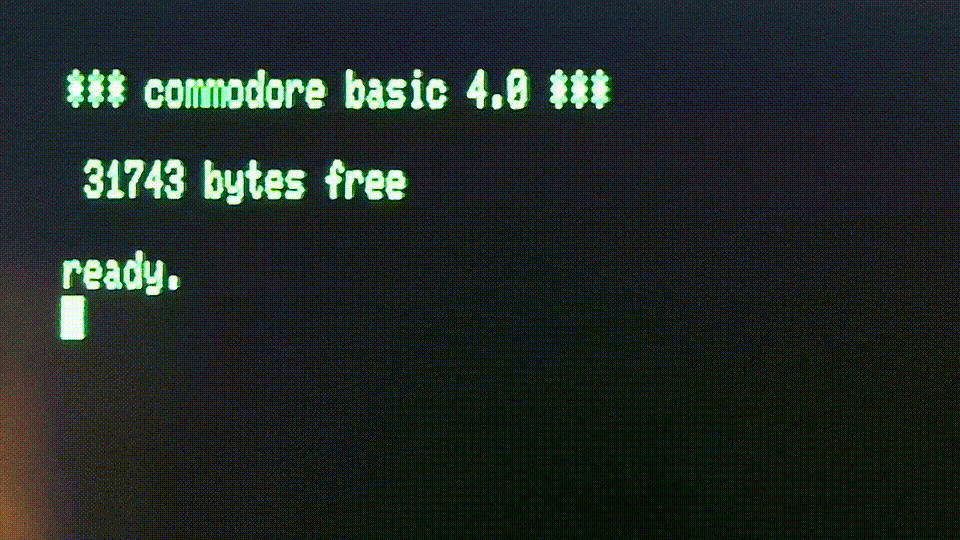

# laboratory

[Degeneracy Before Collapse](https://standardgalactic.github.io/laboratory/degeneracy-before-collapse.pdf)

[Dangerous Sounding Speech](https://standardgalactic.github.io/laboratory/dangerous-sounding-speech.pdf)

[Chemical Identity Is Not Causation](https://standardgalactic.github.io/laboratory/chemical-identity-is-not-causation.pdf)

---

[Projects](https://github.com/standardgalactic/laboratory/blob/main/projects/README.md)

[Continuation Geometry](https://github.com/standardgalactic/laboratory/blob/main/continuation-geometry/README.md)

[Ensemble Before Selection](https://standardgalactic.github.io/laboratory/working/ensemble-before-selection.pdf)

[Depth Before Derivation](https://standardgalactic.github.io/laboratory/depth_before_derivation.pdf)

[Distinction and Continuation](https://standardgalactic.github.io/laboratory/distinction-and-continuation.pdf)

[Distinction Holonomy](https://standardgalactic.github.io/laboratory/distinction-holonomy.html) — *Interactive Experiment*

[Borrowed Intuition](https://standardgalactic.github.io/laboratory/borrowed-intuition.pdf)

[Address Before Operator](https://standardgalactic.github.io/laboratory/address-before-operator.pdf)

* [Interactive ed/vim Grammar Comparator](https://standardgalactic.github.io/laboratory/address-before-operator.html)

[Deployment-Native Ternary Learning](https://standardgalactic.github.io/laboratory/deployment_native_ternary_learning.pdf)

[Consensus Without Independence](https://standardgalactic.github.io/laboratory/consensus-without-independence.pdf)

[Latency of Evidence](https://standardgalactic.github.io/laboratory/latency-of-evidence.pdf)

