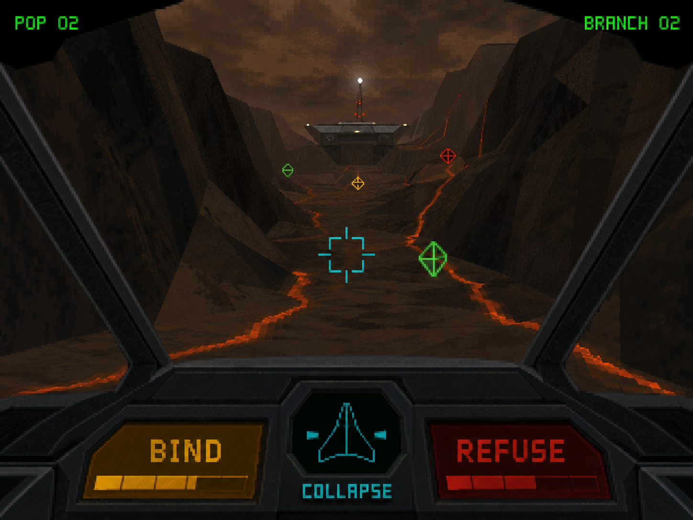

[Sufficiency Under Compression](https://standardgalactic.github.io/laboratory/source/sufficiency-under-compression.pdf)

[Representational Simplicity](https://standardgalactic.github.io/laboratory/source/representational-simplicity.pdf)

[Why No One Talks Backward](https://standardgalactic.github.io/laboratory/source/why-no-one-talks-backwards.pdf)

[Operator Residue](https://standardgalactic.github.io/laboratory/source/operator-residue.pdf)

[Emotional Differentiation](https://standardgalactic.github.io/laboratory/source/emotional-differentiation.pdf)

[Relativistic Longevity](https://standardgalactic.github.io/laboratory/source/relativistic-longevity.pdf)

[Attention Compiler](https://standardgalactic.github.io/laboratory/source/attention-compiler.pdf)

[Attention Compiler Extended](https://standardgalactic.github.io/laboratory/source/attention-compiler-extended.pdf)

[Crinkle-Cut Supercube](https://standardgalactic.github.io/laboratory/source/crinkle-cut-supercube.pdf)

[Monotonic Learning](https://standardgalactic.github.io/laboratory/source/monotonic-learning-plan.pdf)
